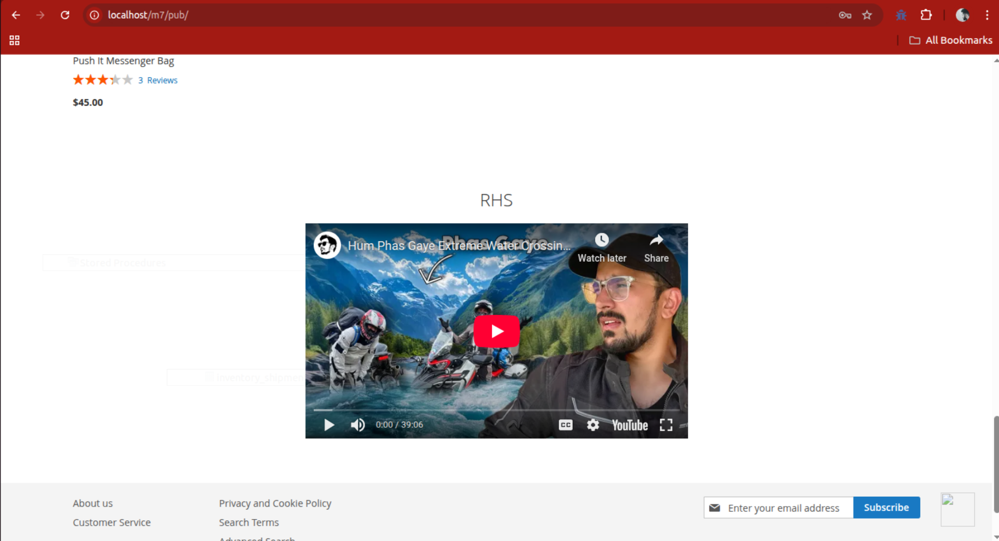

# M2Commerce: Magento 2 YouTube Video Widget

This Magento 2 extension adds a fully configurable **YouTube Video Widget** that allows store admins to easily embed YouTube videos anywhere on the storefront using Magento's widget system.

---

## 🧩 Features

- Add any YouTube video using Magento’s built-in **Widget** tool.
- Supports full YouTube video URLs (e.g., `https://www.youtube.com/watch?v=abc123XYZ`, `https://youtu.be/abc123XYZ`).
- Easily set:
    - ✅ Video title
    - ✅ Width & height of the player
    - ✅ Autoplay on/off
- Clean, responsive, and customizable iframe embed.
- No need for system configuration — everything is handled via the widget UI.

---

## 🧰 Usage

**Admin Panel:**

1. Go to `Content > Widgets`.
2. Click **Add Widget**.
3. Choose **YouTube Video Widget** as the type.
4. Select a design theme and continue.
5. In the widget options:
    - **YouTube Video URL** – Paste the full URL (e.g., `https://www.youtube.com/watch?v=dQw4w9WgXcQ`)
    - **Video Title** – Optional title displayed above the video
    - **Width** – Iframe width (default: 560)
    - **Height** – Iframe height (default: 315)
    - **Autoplay** – Yes/No to control autoplay behavior
6. Choose where to display the widget (e.g., CMS page, layout block).
7. Save and flush the Magento cache.

# ScreenShots


## 📦 Installation

1. Copy the extension to:
```
app/code/M2Commerce/YoutubeWidget
```

2. Run the following commands from your Magento root directory:

```bash
php bin/magento module:enable M2Commerce_YoutubeWidget
php bin/magento setup:upgrade
php bin/magento setup:di:compile
php bin/magento cache:flush
```
