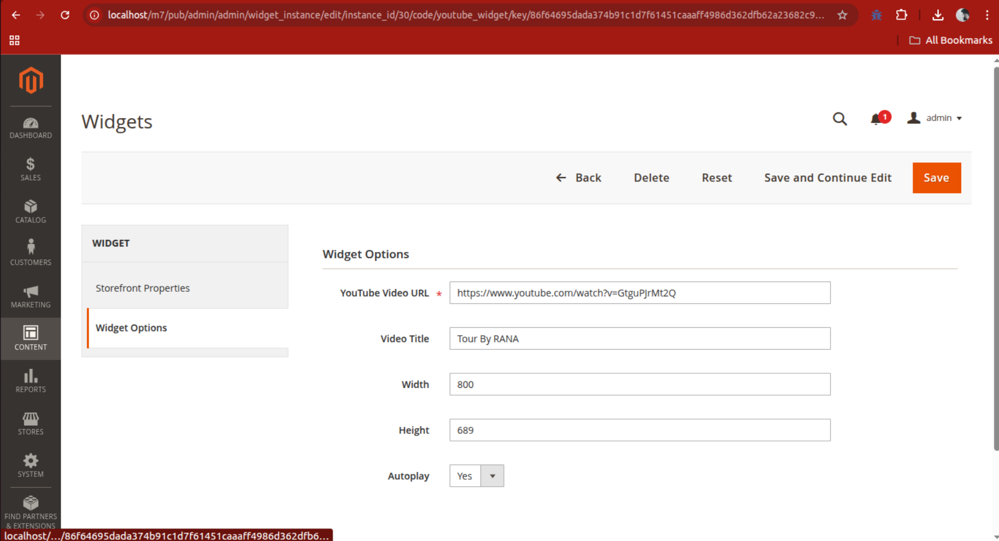

# BugsBunny: Magento 2 YouTube Video Widget

This Magento 2 extension adds a configurable **YouTube Video Widget** to your store’s frontend.  
Admins can enable or disable the widget and insert any YouTube video URL directly from the admin panel.  
The video will then be embedded and visible on all frontend pages (or wherever you place the block).

---

## 🧩 Features

- Embed any YouTube video on the storefront.
- **Enable/Disable** the video widget from Magento admin.
- **Paste full YouTube video URL** (supports formats like `https://www.youtube.com/watch?v=abc123XYZ`, `https://youtu.be/abc123XYZ`).
- Clean and responsive video iframe.
- Uses Magento’s native configuration system.
- Automatically extracts the video ID from the URL.

---

## ⚙️ Configuration

**Admin Panel:**  
`Stores > Configuration > BugsBunny > YouTube Widget`

You will find the following options:

- **Active** – Yes/No to enable or disable the video.
- **YouTube Video URL** – Paste full YouTube video URL here (e.g., `https://www.youtube.com/watch?v=dQw4w9WgXcQ`)

# ScreenShots



## 📦 Installation

1. Copy the extension to:
   ```app/code/BugsBunny/YoutubeWidget```

2. Run the following commands from your Magento root directory:

```bash
php bin/magento module:enable BugsBunny_YoutubeWidget
php bin/magento setup:upgrade
php bin/magento setup:di:compile
php bin/magento cache:flush
```
